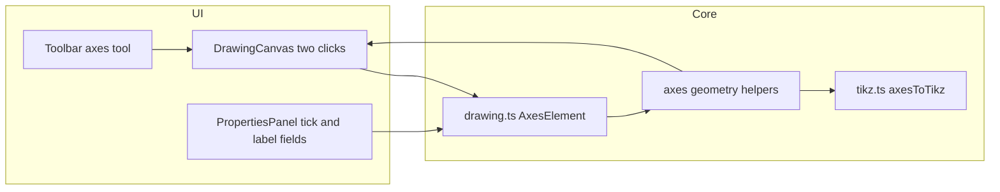

# 坐标轴能力（轴线 + 刻度 + 标签）

## 现状与缺口

- 画布在 [`src/components/DrawingCanvas.tsx`](src/components/DrawingCanvas.tsx) 里用两条 SVG `line.axis` 做过原点处的 **装饰性** 轴线（约 367–368 行），**不会进入** [`src/lib/tikz.ts`](src/lib/tikz.ts) 生成的 TikZ。
- 用户选择的是 **轴线 + 刻度 + 轴标签** 的完整能力，因此需要：新的图元类型、交互、SVG 预览、TikZ 导出，以及属性面板中的轴专用字段。

## 数据模型

在 [`src/types/drawing.ts`](src/types/drawing.ts) 中：

1. 扩展 `Tool`，增加 `'axes'`。
2. 新增 `AxesElement`，建议字段（与现有 `RectangleElement` 两点习惯一致，便于实现草稿逻辑）：
   - `origin: Point`、`extent: Point`：与当前矩形语义一致，用两点确定水平/垂直跨度。
   - **轴线几何**（导出与预览统一用同一套推算函数，避免重复逻辑）：
     - `xAxis`：从 `(min(origin.x, extent.x), origin.y)` 到 `(max(origin.x, extent.x), origin.y)`
     - `yAxis`：从 `(origin.x, min(origin.y, extent.y))` 到 `(origin.x, max(origin.y, extent.y))`
   - `style: DrawingStyle`：轴线与刻度线共用描边样式（线宽、颜色、线型、opacity）；箭头建议 **仅在朝向 +x / +y 的一端** 使用 `style.endArrow`，另一端 `startArrow` 置 `none`（与常见数学坐标轴一致；若将来要双箭头再在属性里扩展）。
   - **轴专用参数**（不参与 `DrawingStyle`）：
     - `tickStepX`, `tickStepY`：`number`（例如默认 `1`；`≤0` 表示该轴不画刻度）
     - `showTicks`, `showTickLabels`：`boolean`
     - `labelX`, `labelY`：`string`（允许 `$x$` 等，直接写入 TikZ `node`；需在文档中说明需合法 LaTeX）

3. 将 `AxesElement` 并入 `DrawingElement`；扩展 `DraftElement` 的 `type` 联合类型包含 `'axes'`。

建议把「由 `origin`/`extent` 推出 x/y 轴线端点 + 刻度采样列表」抽成小纯函数，放在 [`src/lib/geometry.ts`](src/lib/geometry.ts)（或新建 `src/lib/axes.ts` 若希望保持 geometry 只做坐标变换），供 Canvas、TikZ、属性校验共用。

**刻度采样**：在 `[min, max]` 上按 `step` 生成序列，可跳过 `0`（避免与原点重复），数值展示沿用 [`formatNumber`](src/lib/geometry.ts)。

## 交互（与现有工具一致）

- [`src/components/Toolbar.tsx`](src/components/Toolbar.tsx)：增加「坐标轴」按钮。
- [`src/components/DrawingCanvas.tsx`](src/components/DrawingCanvas.tsx)：
  - `toolHint` 增加说明（例如：第一点为原点，第二点确定 x、y 轴向延伸范围）。
  - `handleCanvasClick`：与 `rectangle` 相同的两段式草稿 → 第二次点击 `onCreate` 生成 `AxesElement`。
  - **预览渲染**：两条 `<line>` 轴线；刻度用短线段（x 轴刻度为竖向短线，y 轴为横向短线）；刻度标签用 `<text>`（可用较小 `fontSize`，坐标用 `tikzToSvg`）；轴名称放在 **正方向一端** 附近（与 TikZ `node` 位置对应规则一致即可）。
  - `draftElement` 映射：草稿阶段合并为临时的 `AxesElement` 形状用于预览。

## TikZ 导出

在 [`src/lib/tikz.ts`](src/lib/tikz.ts) 中新增 `axesToTikz`：

- 两条 `\draw`：分别输出 x 轴、y 轴，复用现有 `styleToTikzOptions`（注意箭头只在正向端点一侧生效时可拆成：路径始终从 min→max，这样 `endArrow` 落在正方向端点）。
- **刻度**：对每个刻度坐标生成极短的垂线段 `\draw ... (tick, oy + δ) -- (tick, oy - δ);`（y 轴同理）；刻度标签用 `\node[font=\small] at (...) {...};` 或内联 `node {...}`。
- **轴标签**：在 x 轴正向端点附近、`y` 轴正向端点附近各放一个 `node`（如 `[right]` / `[above]`）。
- `elementToTikz` 增加 `axes` 分支；`buildTikzPicture` 的颜色收集逻辑已按 `element.style.drawColor` 工作，无需改动。

如刻度标签过多导致拥挤，可在第一版采用固定 `font=\small` + 与现有 `formatNumber` 一致的字符串；后续再优化为自动稀疏刻度。

## 属性面板

[`src/components/PropertiesPanel.tsx`](src/components/PropertiesPanel.tsx)：

- `elementTypeLabel` 增加 `axes: '坐标轴'`。
- 当 `selectedElement.type === 'axes'` 时，在通用样式下方显示：
  - `tickStepX` / `tickStepY`（数字）
  - `showTicks` / `showTickLabels`（checkbox）
  - `labelX` / `labelY`（文本）
- 更新时用 `{ ...selectedElement, tickStepX: ... }` 等方式；仍需保留删除与通用线样式编辑。

## 其它说明

- **画布上原有的 CSS 参考轴**：建议保留，作为网格/对齐辅助；用户新增的坐标轴会出现在 TikZ 与 PDF 中。若视觉上两条重叠过明显，可在实现阶段微调 `.axis` 透明度（可选小改动）。
- **LaTeX**：现有文档类已引入 `tikz`；轴标签中的 `$...$` 一般可直接编译。若标签含特殊字符，属于用户输入责任范围，第一版不必做完整转义引擎。
- **测试**：仓库暂无自动化测试；实现后至少手动跑 `npm run lint` 与 `npm run build`（与 README 一致）。

