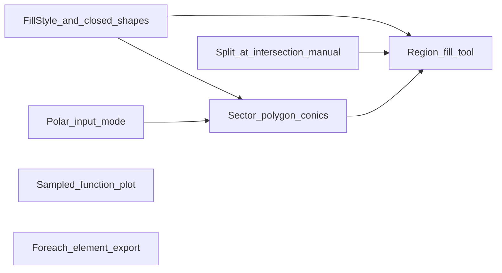

# TikZ Drawer 功能扩展计划

## 现状摘要

- 元素模型为 [`DrawingElement`](src/types/drawing.ts) 判别联合；[`DrawingStyle`](src/types/drawing.ts) 仅有描边相关字段，无 `fill`。
- 导出集中在 [`buildTikzPicture` / `elementToTikz`](src/lib/tikz.ts)；几何与求交在 [`geometry.ts`](src/lib/geometry.ts)；画布交互在 [`DrawingCanvas.tsx`](src/components/DrawingCanvas.tsx)、状态在 [`App.tsx`](src/App.tsx)。
- 路线图 [docs/ROADMAP.md](docs/ROADMAP.md) 已列出 fill、极坐标等，本计划与之对齐并细化实现顺序。

## 依赖关系（建议实施顺序）

---

## 1. 封闭图形填充与子选项（填充类型）

**数据模型**

- 扩展 `DrawingStyle`（或单独 `FillStyle` 嵌入）：例如 `fillMode: 'none' | 'solid' | 'pattern'`（pattern 可第二期只做 `horizontal lines` / `dots` 等 TikZ 常见项）、`fillColor`、`fillOpacity`；与现有 `opacity` 区分或与 TikZ `draw opacity` / `fill opacity` 对齐。
- 闭合图元：`rectangle`、`circle`、`ellipse`；`polyline` 需在「闭合」语义上明确：建议在 polyline 上增加可选 `closed?: boolean`，或在工具栏提供「闭合折线」切换（导出 `-- cycle`）。

**渲染与导出**

- [`tikz.ts`](src/lib/tikz.ts)：闭合路径由 `\draw` 改为 `\path[draw=..., fill=..., fill opacity=...]` 或 `\filldraw[...]`；线型/箭头仍仅作用于可见描边。
- [`DrawingCanvas.tsx`](src/components/DrawingCanvas.tsx)：对应 SVG `fill` / `fillOpacity`，未闭合 polyline 保持 `fill="none"`。

**UI**

- 属性面板（现有样式区）：在选中闭合图元或闭合 polyline 时显示填充区块与子选项（无填充 / 纯色 / 图案下拉 + 图案参数）。

---

## 2. 极坐标支持

**范围界定**

- **输入层**：放置点、半径第二点等交互时，支持「笛卡尔 / 极坐标」切换（角度单位 ° / rad）；内部仍统一存 TikZ 笛卡尔 `Point`，减少全链路改动。
- **导出层**：可选「导出时使用极坐标写法」：对纯径向关系（如从原点出发的线段）生成 `(θ:r)` 语法——可作为后续优化；第一期以保证画布与数值一致为主。

**实现要点**

- [`App.tsx`](src/App.tsx) / [`Toolbar`](src/components/Toolbar.tsx)：坐标模式状态；点输入弹层或侧栏小表单 `(r, θ) → (x, y)`。
- [`geometry.ts`](src/lib/geometry.ts)：`polarToCartesian`、`cartesianToPolar`（注意画布 y 轴与 TikZ 一致）。

---

## 3. 扇形、圆锥曲线、多边形、正多边形

**扇形（sector）**

- 新元素 `sector` 或在 `arc` 上扩展 `kind: 'arc' | 'sector'`：几何为圆心、半径、起止角（与现有 `centerRadiusAngles` 弧一致），画布绘制扇形路径；TikZ：`-- (center) -- cycle` 与弧组合。

**正多边形 / 一般多边形**

- `regularPolygon`：`center`、外接圆上一点（定半径）或半径数值、`n`、`rotationOffset`；顶点按角度均匀采样。
- `polygon`：类似现有 polyline，结束时强制闭合或 `closed: true`，工具上与 polyline 分叉或子工具切换。

**圆锥曲线**

- 采用**参数/显式采样**以符合你选的「画布采样与导出一致」：
  - 抛物线：如 \(y = ax^2+bx+c\) 或顶点+焦点定义 → 在 \(x\) 区间采样 → `polyline` 或专用 `conicCurve` 元素存 `kind`+系数+域。
  - 椭圆/双曲线：标准方程或中心+半轴+旋转角；双曲线取两支时需两段 polyline 或 `path` 多段。
- TikZ 导出：可用 `\draw plot coordinates {...}` 与画布同一点列，或 `pgfplots`（需在 [`src-tauri/src/lib.rs`](src-tauri/src/lib.rs) 的 preamble 中按需加包）；优先 **`plot coordinates`** 以降低编译依赖。

---

## 4. 求交点后分割（手动）

**交互（你已选）**

- 在已有 [`intersection`](src/components/DrawingModals.tsx) / [`computeIntersections`](src/lib/geometry.ts) 流程之后，增加命令：**「在交点处分割」**（工具栏按钮或交点 Modal 内）；仅对当前**选中**的、参与过求交的可分割元素生效。

**几何**

- **线段 / 折线**：对每条边计算与已得到交点的参数位置，在参数处插入顶点或拆成多条 `line`。
- **弧**：将交点映射到弧上角度，拆成两条 `arc`（复用 `centerRadiusAngles` 模式存储）。
- **圆/椭圆**：完整曲线 rarely split into arcs without ellipse arc support —— 第一期可限定：**仅分割 line、polyline、arc**；圆椭圆提示「暂不支持」或第二期用多段逼近。

**状态**

- 分割后删除原元素 id，插入新元素；保持 `undo` 若后续有加栈。

---

## 5. 填充封闭区域（点空白 / 选边围成）

分两路满足描述：

1. **点击空白**：从点击位置射线投射，对当前图层上「可构成边界」的线段/弧做求交，构造环绕区域（计算量大且有二义性）。**可行 MVP**：仅支持由 **line + polyline（闭合）+ rectangle/circle/ellipse/sector** 等组成的区域；或简化。**更稳妥 MVP**：点击选中已有「闭合」元素直接应用填充样式（与 §1 重叠）；「任意区域」第二期再做平面细分。
2. **选择围成封闭图形的边**：用户多选若干 `line`/`arc`，在校验构成简单闭合环后，合并为单个 **`region` 或 `filledPath`** 元素**：有序边表 + 顶点序列**，画布 `fill`，TikZ `filldraw` + `-- cycle` 或多段。

**实现顺序建议**：先做「多选边 → 检测闭合 → 生成 `filledPath`」，再做「点击检测最近闭合域」（可选）。

---

## 6. 给定函数、方程绘图（采样一致）

- 新元素类型例如 `functionPlot`：`expression`（受限 DSL 或 math.js 类安全子集）、变量名默认 `x`、`domain`、`samples`、`coordinateRotation`（可选极坐标 \(r(\theta)\) 模式与 §2 联动）。
- 运行时：`samples` 点在 JS 中求值 → 画布 `polyline` 渲染；[`tikz.ts`](src/lib/tikz.ts) 输出相同坐标表的 `\draw plot coordinates {...}`。
- **方程** \(F(x,y)=0\)：MVP 用网格求符号变化 + 线性插值追踪等高线（近似）；-doc 标明精度限制；复杂隐式曲线可后续接 marching squares。

---

## 7. `\\foreach` 循环绘制

- 新元素 `tikzForeach`：`iterator`（如 `\i`）、`list`（`1,...,10` 或 `{a,b,c}`）、`bodyTemplate`（含有占位符或直接使用 TikZ 片段）；设置「预览迭代数」上限避免画布爆炸。
- **画布预览**：展开前 N 项生成临时几何（线/点）用于显示；**导出**：原样输出 `\foreach ... \draw ...`。
- 安全：对用户输入做基本校验，避免未闭合括号破坏 LaTeX。

---

## 文档与工程约定（按你的仓库规则）

- 实施阶段同步更新 [CHANGELOG.md](CHANGELOG.md)、[docs/](docs/) 中的计划/对话摘要；较大行为变更更新 [README.md](README.md)。
- Rust 侧若增加 LaTeX 包（如 `pgfplots`），需在文档说明编译要求。

## 风险与简化边界

- **任意区域填充**与**椭圆弧边界**：算法复杂；第一期用「闭合折线/矩形/圆/扇形 + 选边成环」覆盖主要教学场景。
- **表达式求值**：务必限制函数白名单与表达式长度，防止性能与安全 issues。
