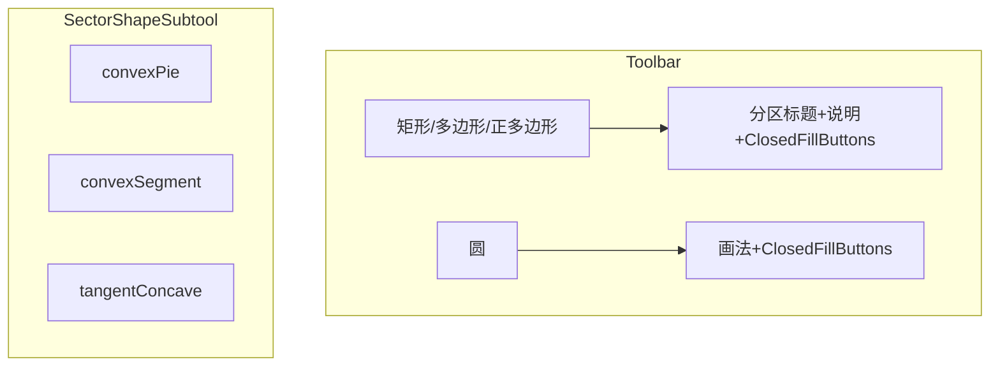

# 封闭图形菜单统一与扇形三模式

## 0. 工具栏按钮（必选，勿遗漏）

实现时 **所有** 新建子功能必须在左侧 [`Toolbar.tsx`](src/components/Toolbar.tsx) 中有 **可点击的控件**，不得以纯说明文字代替交互：

- **矩形 / 多边形 / 正多边形**：点击主工具按钮后，浮动菜单内须有 **分区标题 +「新建时填充」下的两个选项按钮**（无填充 / 浅色实心填充），结构与圆一致；若增加简短工具说明，说明可为静态文案，但 **填充两项必须是 `button`**（沿用 [`ClosedFillButtons`](src/components/Toolbar.tsx)）。
- **扇形**：浮动菜单内须有 **三个独立 `tool-menu-item` 按钮** 对应 **外凸扇形、外凸弓形、内凹扇形**，以及 **两个填充按钮**（与全局 [`ClosedFillButtons`](src/components/Toolbar.tsx) 一致）；当前选中项须有 `active` 样式，便于辨认。
- 左侧 **主工具列** 仍保留「矩形」「多边形」「正多边形」「扇形」各一条 **主按钮**（现有 `primaryTools`）；子选项只在点击后主按钮弹出浮层中列出。

验收：每种模式/填充组合均可仅通过工具栏点选完成，无需依赖属性栏才能完成首次选用。

---

## 1. 矩形 / 多边形 / 正多边形：菜单与圆一致

当前：三者使用 [`submenu: 'closedFill'`](src/components/Toolbar.tsx)，仅渲染 [`ClosedFillButtons`](src/components/Toolbar.tsx)，无「画法」区，样式已 `toolbar-floating-menu-wide`，但与 [`openSubmenu === 'circle'`](src/components/Toolbar.tsx) 相比缺少顶部分区标题与视觉层级。

**做法**：

- 抽取与圆菜单相同的壳层：例如 `toolbar-floating-menu toolbar-floating-menu-wide` + 首段 **「画法」或工具说明**（矩形/多边形无子选项时可写一句固定说明或占位标题如「两点拖矩形」/「逐点 Esc 闭合」/「圆心+顶点+边数对话框」），其下再接 **「新建时填充」** + [`ClosedFillButtons`](src/components/Toolbar.tsx)（与圆、椭圆第二段完全一致）。
- 将 `closedFill` 分支改为与 `circle` 同结构的 JSX（仅第一段内容按工具变化）；必要时为矩形/多边形/正多边形增加 [`toolbar-floating-menu-rectangle`](src/App.css) 等 `top` 偏移（可与 `circle` 对齐或共用类），避免菜单与按钮错位。
- **不改变** [`commitNewElement`](src/App.tsx) 与 [`closedShapeFillSubtool`](src/App.tsx) 逻辑；仍只对勾选「浅色实心填充」时套用 [`withClosedShapeDefaultFillIfApplicable`](src/types/drawing.ts)。

---

## 2. 扇形三种子模式（类型与命名）

在 [`src/types/drawing.ts`](src/types/drawing.ts) 将扇形模式扩展为三档（命名示例，实现时可选用短枚举值）：

| 模式 | 含义 | 与现有映射 |
|------|------|------------|
| **外凸扇形** | 首点为**圆心**，两半径+弧（当前 CCW 饼楔） | 现有 `pie` |
| **外凸弓形** | **弦 + 较小圆弧**，不画圆心到弧端半径（仅边界弦与弧） | 现有 `segment` |
| **内凹扇形** | 首点为**两切线交点** \(P\)，两边为到圆的切线；圆由后续两点确定；弧相对楔呈「凹陷」 | **新增** |

- 将 [`SectorShapeMode`](src/types/drawing.ts) / [`SectorShapeSubtool`](src/types/drawing.ts) 从 `'pie' \| 'segment'` 扩展为 `'convexPie' \| 'convexSegment' \| 'tangentConcave'`（或保留内部别名并迁移旧存档 `pie→convexPie`、`segment→convexSegment`）。
- [`SectorElement`](src/types/drawing.ts)：内凹模式需持久化 **顶点 \(P\)** 与圆参数（已有 `center`、`radius`、切点方位角或等价字段）。建议增加可选字段，例如 `apex?: Point`（切线交点）、`tangentStartDeg`/`tangentEndDeg` 或由 \(P,O,r\) 导出并缓存角度以便 TikZ/画布一致。

---

## 3. 内凹扇形：几何约定（实现要点）

**交互顺序（建议）**：第 1 击 \(P\)（切线交点）→ 第 2 击圆心 \(O\) → 第 3 击圆周上一点定半径 \(r=|OU|\)（与现有「圆心 + 两弧点」区分：首点语义不同）。

**几何**（需 `distance(P,O) > r + ε`，否则无两条外切线）：

- 由 \(P,O,r\) 求两切点 \(T_1,T_2\)（相对 \(O\) 的方位角，标准两切线公式）。
- 填充区域边界：`P → T_1 →` **圆弧** `T_1→T_2` → `T_2 → P`。  
  **凹弧**：在「三角形 \(P T_1 T_2\)」一侧，取两切点间**绕圆背离 \(P\) 的那段弧**（通常为**优弧**，圆心在弦 \(T_1T_2\) 的另一侧），使弧边相对三角形内向 \(P\)「凹陷」——与现有外凸饼楔「弧凸向圆外」形成对比。具体用 [`getArcGeometry`](src/lib/geometry.ts) + 与 [`minorArcSignedSweep`](src/lib/sectorAngles.ts) 对称的 **major** 弧扫角实现，并在 [`sectorGeometry.ts`](src/lib/sectorGeometry.ts) 或新文件 `tangentSectorGeometry.ts` 中集中实现 `pathD` / TikZ 片段。

**画布**：[`DrawingCanvas`](src/components/DrawingCanvas.tsx) 中 `draft.type === 'sector'` 按 [`sectorShapeSubtool`](src/components/DrawingCanvas.tsx) 分三支预览；内凹模式草稿需存 `phase` 或 `points.length` 区分三步。

**导出**：[`sectorToTikz`](src/lib/tikz.ts) 增加 `tangentConcave`：`P -- T1 -- arc ... -- T2 -- cycle`。

**求交**：[`appendSector`](src/lib/geometry.ts) 分支：线段 `P-T1`、`P-T2` + 弧 `T1-T2`（与 [`splitGeometry`](src/lib/splitGeometry.ts) 兼容）。

**命中**：[`hitTest.ts`](src/lib/hitTest.ts) 对切线区域用弦+弧密集采样多边形（与弓形类似）。

**框选**：[`elementSvgBounds.ts`](src/lib/elementSvgBounds.ts) 对切线模式取 \(P,T_1,T_2\) 及弧包络的 AABB。

---

## 4. 工具栏与 App 状态

- [`Toolbar.tsx`](src/components/Toolbar.tsx)：扇形浮层内 **三个模式按钮 + 两个填充按钮**（见 §0）；矩形/多边形/正多边形浮层 **两个填充按钮 + 与圆一致的分区布局**。
- [`App.tsx`](src/App.tsx)：`sectorShapeSubtool` 默认 `'convexPie'`；[`commitNewElement`](src/App.tsx) 仍按 [`closedShapeFillSubtool`](src/App.tsx) 决定是否填充；新建扇形写入扩展后的 `sectorShape`。

---

## 5. 属性栏与迁移

- [`PropertiesPanel.tsx`](src/components/PropertiesPanel.tsx)：扇形「形状」下拉改为三选项；[`sectorEffectiveShape`](src/types/drawing.ts) 迁移旧 `pie`/`segment`/`inverseArc`。

---

## 6. 文档与校验

- 更新 [`CHANGELOG.md`](CHANGELOG.md)、[`README.md`](README.md) 一句说明。
- `npm run build` + `npm run lint`；手工验证：三模式下预览、编译 PDF、交点工具、填色拾取。

