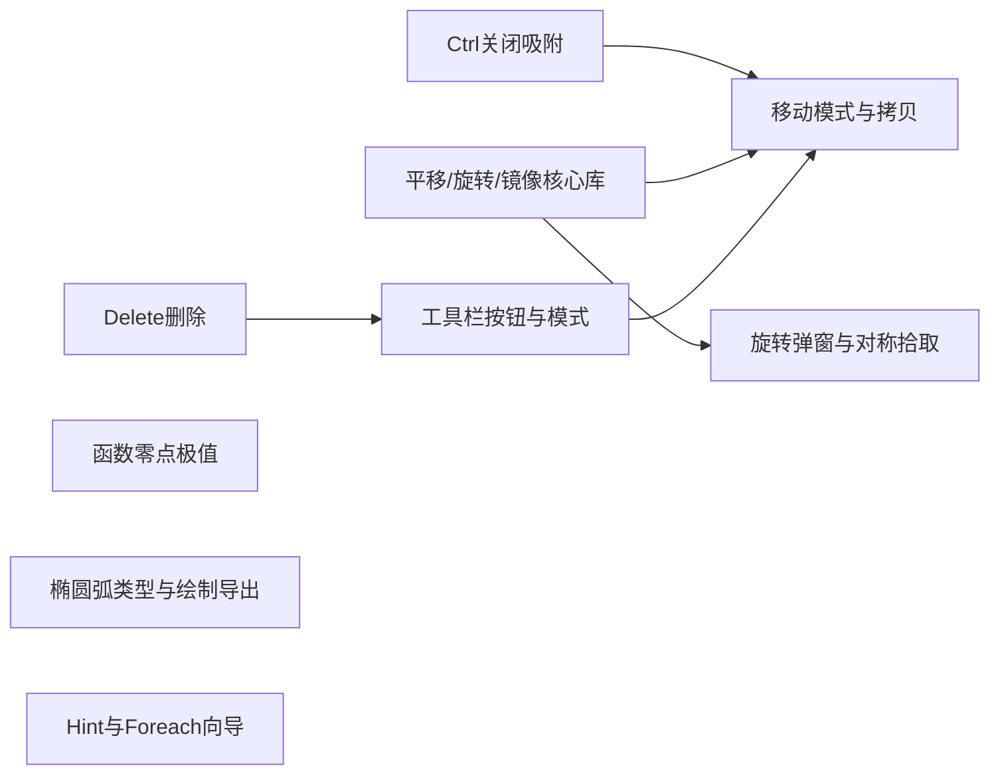

# 画布编辑、变换与函数辅助点实施计划

## 现状摘要（代码依据）

- 画布点击与草稿移动统一调用 [`snapTikzPoint`](src/lib/geometry.ts)，未区分 Ctrl（示例：[`DrawingCanvas.tsx`](src/components/DrawingCanvas.tsx) 约 303、489 行）。
- 选中图元后只能通过 [`PropertiesPanel`](src/components/PropertiesPanel.tsx) 里「删除」按钮移除；未见画布拖拽平移选中集合。
- 函数图由 [`FunctionPlotModal`](src/components/DrawingModals.tsx) 写入单个 [`functionPlot`](src/types/drawing.ts) 元素；采样在 [`sampleFunctionPlot`](src/lib/plotSamples.ts)。
- TikZ 圆弧导出均为圆半径 [`arc[..., radius=...]`](src/lib/tikz.ts)，需扩展椭圆弧语法。
- Foreach 向导当前仅为变量名、列表、正文、预览上限（[`ForeachModal`](src/components/DrawingModals.tsx) 约 718–775 行）。
- 你已确认：**拷贝偏移默认取当前 `gridConfig.gridStep`**，沿数学坐标「右下 45°」即偏移向量 `(s, -s)`，`s = gridStep`（TikZ `y` 轴向上）。

---

## 1. 函数图：零点与极值点图元

**范围**：仅 **笛卡尔显式** `y=f(x)`、且无 `implicitEquation` 时生成辅助点；极坐标/隐式可保留「不生成」或在 UI 提示原因。

**算法（数值）**：

- 与现有采样一致，在 `[domainMin, domainMax]` 上密化采样（可与 `samples` 同阶或略密）。
- **零点**：相邻样本 `(x_i,y_i),(x_{i+1},y_{i+1})` 若 `y_i·y_{i+1}≤0` 且非 NaN，线性插值估根 `x*`；去重（间距小于 `ε`）。
- **极值**：在采样序列上找局部极大/极小（严格比较相邻三点）；边界点可按需求纳入或排除（建议默认 **不含端点** 以减少噪声，可在模态勾选「含端点」后续再加）。

**产物**：在确认添加函数图时，额外 `push` 若干 [`point`](src/types/drawing.ts)（或复用 `intersectionPoint` 仅样式区分——建议仍用 `point`，`label` 填「零点」「极大」「极小」或留空由属性改）。

**代码落点**：

- 新建 [`src/lib/functionPlotMarkers.ts`](src/lib/functionPlotMarkers.ts)（或并入 `plotSamples.ts`）：输入 `FunctionPlotElement`，输出 `{ zeros: Point[], extrema: Array<{ kind: 'max'|'min'; p: Point }> }`。
- [`App.tsx`](src/App.tsx) 中 `FunctionPlotModal` 的 `onConfirm`：在 `setElements` 时追加函数元素 + 生成的点列（新 id）。
- 可选：在 [`FunctionPlotModal`](src/components/DrawingModals.tsx) 增加勾选「创建零点与极值点」默认开启。

---

## 2. Ctrl：临时关闭吸附（以鼠标所在 TikZ 点为准）

**规则**：`event.ctrlKey === true` 时 **不对该次坐标** 调用 `snapTikzPoint`，直接使用 `svgToTikz(getSvgPoint(...))`。

**修改面**：

- [`DrawingCanvas.tsx`](src/components/DrawingCanvas.tsx)：`handleCanvasClick`、`handleMouseMove`（草稿）、以及凡构造 `point` 且当前需吸附的路径；统一小工具函数 `maybeSnap(raw, event, cs, gridStep)`。
- [`App.tsx`](src/App.tsx) 中在模态确认里手动 `snapTikzPoint` 的位置（如圆弧圆心模式）：若无法拿到键盘状态，可保持吸附或仅在「画布点击」路径支持 Ctrl（与需求「一般元素」一致即可）。

**状态栏**（可选）：在按住 Ctrl 时 [`StatusBar`](src/components/StatusBar.tsx) 一行提示「吸附已关闭」。

---

## 3. Delete / Backspace 删除选中

- 在 [`App.tsx`](src/App.tsx)（或独立 `useCanvasShortcuts` hook）监听 `keydown`：`Delete` / `Backspace`，若 `target` 不是 `input/textarea/contenteditable`，则对 `selectedIds` 执行与属性面板相同的删除逻辑（含交点缓存清理等已有副作用）。
- 与 [`Toolbar`](src/components/Toolbar.tsx) 内 Escape 关闭子菜单无冲突。

---

## 4–7. 工具栏按钮：移动、拷贝、旋转、对称

**UI 位置**：与现有 [`Toolbar`](src/components/Toolbar.tsx) 并列增加一块 **编辑动作区**（或放在 [`StatusBar`](src/components/StatusBar.tsx) 右侧），四个按钮：**移动**、**拷贝**、**旋转**、**对称**。无需新增 `Tool` 枚举中的「绘制工具」即可；用 React state 表示 **变换模式**：

```text
transformMode: 'idle' | 'move' | 'mirrorPick'
```

以及旋转用 **模态**（见下）。

**多选**：所有操作对 `selectedIds` 全体生效；若无选中则按钮 `disabled` 或 noop。

### 4. 移动

- 点击「移动」→ `transformMode = 'move'`（再次点击或 Esc 取消）。
- 画布上 **指针拖拽**：记录按下时鼠标 TikZ 点与当前选中集合快照；`pointermove` 用 `(当前点 - 起点)` 作为平移向量 **加** 到各图元几何上。
- **吸附**：松开或移动过程中对 **平移向量** 或 **目标位置** 按 `snapTikzPoint` 量化；**按住 Ctrl** 时不吸附（与第 2 条一致）。
- 实现核心：新建 [`src/lib/translateElements.ts`](src/lib/translateElements.ts)（或 `elementTransform.ts`），对 `DrawingElement` 联合类型做分支平移（与现有几何类型一一对应，可参考 [`tikzCenterOfElement`](src/lib/elementCenter.ts) 各处用到的字段）。

### 5. 拷贝

- 点击「拷贝」：**立即** 克隆 `selectedIds` 对应元素（新 `id`），全体相对原图元平移 **`(gridStep, -gridStep)`**（你已选 gridStep；即右下 45°）。
- 选中新拷贝集合，便于继续编辑。

### 6. 旋转

- 点击「旋转」→ 打开小模态（新建 `RotateModal` in [`DrawingModals.tsx`](src/components/DrawingModals.tsx)）：输入角度 **度**，逆时针为正，负值为顺时针。
- **旋转中心**：选中集合的 **包围盒中心**（用现有 [`elementSvgBounds`](src/lib/elementSvgBounds.ts) 在 TikZ 空间算中心，或对所有顶点包络），与用户直觉一致。
- [`src/lib/rotateElements.ts`](src/lib/rotateElements.ts)：绕中心二维旋转各图元控制点（笛卡尔角：`x' = cx + (x-cx)cosθ - (y-cy)sinθ` 等）。

### 7. 对称

- 点击「对称」→ `transformMode = 'mirrorPick'`，提示栏说明两步。
- **方式 A**：点击一条已有 **`line`** 图元 → 取该直线为镜像轴（无限延长）。
- **方式 B**：在空白处 **依次点击两点** → 定义对称轴（过两点直线）。
- 第二次输入完成后调用 **反射**（点到直线距离公式），更新选中集合；随后 `transformMode = 'idle'`。
- 直线方程：`Point` 两点 → 单位法向量/投影，与 [`distance`](src/lib/geometry.ts) 等组合即可。

---

## 8. 工具悬浮 hint

- 扩展 [`Toolbar.tsx`](src/components/Toolbar.tsx)：`title` 改为更完整中文说明（快捷键若有则写上）；主按钮区可用现有浏览器原生 tooltip。
- 若需「多行/格式化」：增加轻量 CSS `.toolbar-hint` + `data-tooltip` + `::after`，或复用项目内若有 Tooltip 组件。**优先最小改动：加长 `title` + 新按钮同样设置 `title`。**

---

## 9. 椭圆弧（TikZ 原生）

**模型**：扩展 [`ArcElement`](src/types/drawing.ts) 或新增 `ellipseArc` 类型（二选一，推荐 **扩展** `ArcElement`）：

- 增加可选字段：`radiusX`, `radiusY`（TikZ 单位）、`rotationDeg`（椭圆主轴相对 x 轴，默认 0）。
- 子工具：在 [`ArcSubtool`](src/types/drawing.ts) 增加一项（如 `ellipseSweep`），[`Toolbar`](src/components/Toolbar.tsx) 子菜单与 [`App.tsx`](src/App.tsx) 状态联动。
- **交互草稿**（与圆类似的两次点击 + 角度）：或「圆心 + 两半径 + 起终角」模态——具体可与现有 `centerRadiusAngles` 复用模式，但 TikZ 输出改为 `arc[x radius=..., y radius=..., start angle=..., end angle=...]`。
- [`DrawingCanvas.tsx`](src/components/DrawingCanvas.tsx)：SVG 路径用椭圆弧参数方程或分解为 `A rx ry xAxisRotation large sweep x y`。
- [`tikz.ts`](src/lib/tikz.ts)：拼接上述 `arc[...]` 选项。

---

## 10. Foreach 向导：更多控件与辅助文案

- 在 [`ForeachModal`](src/components/DrawingModals.tsx) 增加例如：
  - **列表生成助手**：`起始 / 结束 / 步长` 三个数字框 +「填入列表」生成 `1,3,...,9` 形式写入 `listExpr`。
  - **正文预设**：下拉选常见片段（如 `\draw (0,\i)--(1,\i);`）填充 `bodyTemplate`。
  - **辅助文本**：每个字段下 `<p className="hint">` 说明 TikZ `foreach` 与画布预览限制（扩写现有 hint）。
- 不改变 [`TikzForeachElement`](src/types/drawing.ts) 存储结构亦可完成；若要把「助手参数」持久化再考虑扩展字段（默认不必）。

---

## 文档与变更记录（按你的仓库约定）

- 实现阶段在 [`CHANGELOG.md`](CHANGELOG.md) 列出上述功能条目。
- 在 [`docs/`](docs/) 追加本次对话对应的 plan 摘要（若你沿用 `docs/PLAN.md` 或专用 plan 文件）。

---

## 依赖关系（建议实现顺序）



---

## 风险与测试要点

- **变换**：逐类型覆盖 `line/circle/sector/axes/...`，遗漏会导致运行时错误或几何漂移；优先为常用类型写单元测试（纯函数）。
- **对称**：退化两点重合需拒绝并 toast。
- **函数极值**：采样过稀会漏点；可在模态增加「辅助点采样倍数」后续优化。
