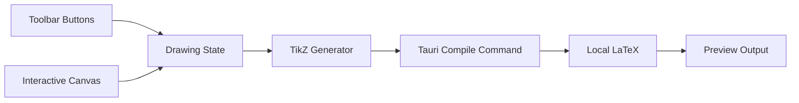

# TikZ 绘图软件实现计划

## 技术方案

- 在 `/Users/lion/Documents/tikz-drawer` 新建 `Tauri + React + TypeScript` 桌面项目。
- 前端用 SVG 做交互式绘图画布，维护内部图元模型；每次修改后同步生成 TikZ 代码。
- Tauri Rust 后端负责调用本机 LaTeX 命令，将 TikZ 包装成完整 `.tex` 文档后编译。
- 初版重点支持固定按钮和表单，不要求用户手写 TikZ 代码。

## 核心数据流

## 前端功能拆分

- `src/App.tsx`：应用主布局，包含工具栏、画布、属性面板、预览区域。
- `src/types/drawing.ts`：定义图元模型，例如直线、圆弧、颜色、线型、箭头类型。
- `src/components/Toolbar.tsx`：固定按钮切换绘制模式。
- `src/components/DrawingCanvas.tsx`：鼠标交互绘制图形。
- `src/components/PropertiesPanel.tsx`：选中图元后修改样式 + 工具专属设置。
- `src/components/PreviewPanel.tsx`：展示 TikZ 代码、编译按钮和编译日志。
- `src/lib/tikz.ts`：把内部图元转换为 TikZ 代码。
- `src/lib/geometry.ts`：处理画布坐标、TikZ 坐标、圆弧几何计算和求交点算法。

## 图形交互规则

- **直线**：默认两点作图；可选「点与斜率」——先点锚点再在对话框输入斜率与两端 x。竖直线建议仍用两点。
- **圆**：默认「圆心+圆周点」拖拽；可选「圆心+半径数值」——点击圆心后在对话框输入半径。
- **椭圆**：默认「中心+圆周点」拖拽；可选「中心+半轴数值」——点击中心后在对话框输入 x/y 半轴长度。
- **圆弧**：两种定义模式 ——
  - 「两点+扫过角」：点击起点、终点，通过角度输入决定圆弧（默认模式）。
  - 「圆心+半径+角度」：点击圆心，在对话框输入半径 r、起始角 α、终止角 β。TikZ 语法 `arc[start angle=α, end angle=β, radius=r]`，角度以正 x 轴为 0°、逆时针为正。
- **坐标轴**：点击原点后，在对话框中设置 x/y 上下限（支持负半轴）；属性中用选项卡配置原点、上下限、步长、手动刻度（位置与 TikZ 标记名）、轴线显示与轴名称位置（TikZ node 关键字 + 偏移）；数值支持 `1/3`。
- **多段线**：Esc 结束绘制（≥2 点提交，否则取消），无额外按钮。
- **交点**：选择「交点」工具后依次点击两个图元，系统自动计算交点并弹出命名对话框，确认后创建命名点元素。
- **点元素**：通过交点工具或未来直接绘制创建，显示为小圆点和可选标签。
- **吸附**：吸附到 grid 对应的点（使用网格配置中的 `gridStep`），非硬编码整数点。
- **样式设置**：移至右侧属性面板。左侧工具栏无「样式」按钮；激活任意工具时右侧属性面板显示该工具的专属设置及默认线条样式。

## LaTeX 编译方案

- `src-tauri/src/lib.rs` 暴露 `compile_tikz`、`copy_path`、`rasterize_pdf_first_page` 等命令。
- 编译流程：接收 TikZ 代码，写入固定临时工作区（每次编译前清空），调用本机 `pdflatex -interaction=nonstopmode -halt-on-error`，返回编译状态、日志与 PDF 路径；前端可内嵌预览、系统打开、导出 PDF/PNG。
- 默认加载常用 TikZ 库：`arrows.meta`、`calc`、`decorations.pathreplacing`、`positioning`。

## 完成状态

- 已创建 Tauri React TypeScript 项目骨架。
- 已定义图元、样式和绘制模式的数据模型。
- 已实现工具栏、画布交互、直线两点作图和圆弧绘制。
- 已实现图元到 TikZ 代码的转换。
- 已实现 Tauri 后端本机 LaTeX 编译命令和前端预览/日志。
- 已通过 `npm run build`、`npm run lint`、`cargo check` 和本机 `pdflatex` 示例编译验证。

## 2026-05-06 会话增量

- **视图**：`viewOrigin` 状态 + `coordinateSystemWithOrigin`；Alt/中键拖移平移；菜单 View：居中选中图元、重置视图；新建画布时重置视图。
- **刻度**：`tickValuesInRange` 与 `mergeAxisTickMarks` 修正，轴线刻度包含 **0**。
- **网格**：`GridConfig` 增加 `showGridInExport` 与导出范围；`buildTikzPicture` 可选 `\\draw[help lines] ... grid`；菜单 Grid：切换编辑区网格、切换导出网格、打开网格设置对话框。
- **工具栏**：直线/圆弧/圆/椭圆选项改为工具栏右侧浮动菜单；属性面板可滚动、颜色为预设模式。
- **多段线**：Esc 结束绘制（≥2 点提交，否则取消），移除顶部按钮。

## 2026-05-16 会话增量

- **多段线按钮移除**：移除画布顶部「完成多段线」按钮（Esc 已覆盖完成与取消）。
- **圆/椭圆多种定义方式**：新增子工具栏选择「圆心+圆周点」/「圆心+半径数值」及「中心+圆周点」/「中心+半轴数值」；数值模式弹出对话框输入半径/半轴。
- **属性面板增强**：左侧工具栏移除「样式」按钮，激活工具时右侧属性面板显示该工具的专属设置（直线绘制方式、圆弧模式/角度、圆/椭圆子工具等）及默认线条样式。
- **吸附逻辑升级**：`snapTikzPoint` 增加 `gridStep` 参数，使用 `gridConfig.gridStep` 替代硬编码整数吸附，吸附到实际网格点。
- **求交点功能**：新增「交点」工具，依次点击两个图元后计算交点（支持线段-线段、线段-圆、圆-圆），弹出命名对话框创建命名点元素。
- **点元素**：新增 `PointElement` 类型（`type: 'point'`），带 `center` 和 `label` 字段；画布渲染为小圆点+文本标签；TikZ 导出为 `\\draw ... node[circle, fill, inner sep=1.5pt, label={...}]{};`。
- **圆弧 TikZ 对应**：新增「圆心+半径+角度」模式，对话框输入半径 r、起始角 α、终止角 β；TikZ 导出添加参数注释；属性面板中展示参数说明与 TikZ 语法对照。