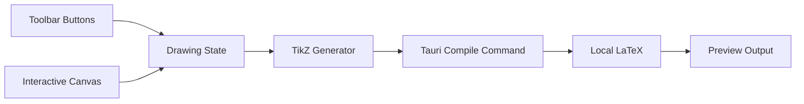

# TikZ 绘图软件实现计划

## 技术方案

- 在 `/Users/lion/Documents/tikz-drawer` 新建 `Tauri + React + TypeScript` 桌面项目。
- 前端用 SVG 做交互式绘图画布，维护内部图元模型；每次修改后同步生成 TikZ 代码。
- Tauri Rust 后端负责调用本机 LaTeX 命令，将 TikZ 包装成完整 `.tex` 文档后编译。
- 初版重点支持固定按钮和表单，不要求用户手写 TikZ 代码。

## 核心数据流

## 前端功能拆分

- `src/App.tsx`：应用主布局，包含工具栏、画布、属性面板、预览区域。
- `src/types/drawing.ts`：定义图元模型，例如直线、圆弧、颜色、线型、箭头类型。
- `src/components/Toolbar.tsx`：固定按钮切换绘制模式和样式。
- `src/components/DrawingCanvas.tsx`：鼠标交互绘制图形。
- `src/components/PropertiesPanel.tsx`：选中图元后修改样式，不直接编辑代码。
- `src/components/PreviewPanel.tsx`：展示 TikZ 代码、编译按钮和编译日志。
- `src/lib/tikz.ts`：把内部图元转换为 TikZ 代码。
- `src/lib/geometry.ts`：处理画布坐标、TikZ 坐标和圆弧几何计算。

## 图形交互规则

- 直线：支持两点作图，第一次点击确定起点，第二次点击确定终点。
- 圆弧：使用起始点、终点、给定角度生成。界面上先选起点、终点，再通过角度输入决定圆弧。
- 样式：通过按钮或选择器设置 `arrow`、`lineStyle`、`strokeColor` 和 `strokeWidth`，并立即应用到新图形或当前选中图形。

## LaTeX 编译方案

- `src-tauri/src/lib.rs` 暴露 `compile_tikz` Tauri command。
- 编译流程：接收 TikZ 代码，写入临时 `.tex` 文件，调用本机 `pdflatex -interaction=nonstopmode -halt-on-error`，返回编译状态、日志和输出 PDF 路径。
- 默认加载常用 TikZ 库：`arrows.meta`、`calc`、`decorations.pathreplacing`、`positioning`。

## 完成状态

- 已创建 Tauri React TypeScript 项目骨架。
- 已定义图元、样式和绘制模式的数据模型。
- 已实现工具栏、画布交互、直线两点作图和圆弧绘制。
- 已实现图元到 TikZ 代码的转换。
- 已实现 Tauri 后端本机 LaTeX 编译命令和前端预览/日志。
- 已通过 `npm run build`、`npm run lint`、`cargo check` 和本机 `pdflatex` 示例编译验证。
