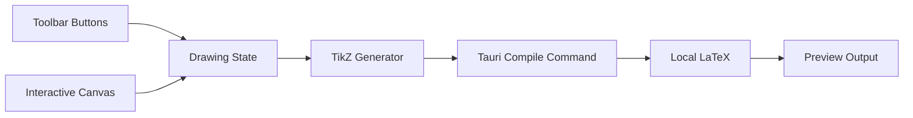

# TikZ 绘图软件实现计划

## 技术方案

- 在 `/Users/lion/Documents/tikz-drawer` 新建 `Tauri + React + TypeScript` 桌面项目。
- 前端用 SVG 做交互式绘图画布，维护内部图元模型；每次修改后同步生成 TikZ 代码。
- Tauri Rust 后端负责调用本机 LaTeX 命令，将 TikZ 包装成完整 `.tex` 文档后编译。
- 初版重点支持固定按钮和表单，不要求用户手写 TikZ 代码。

## 核心数据流

## 前端功能拆分

- `src/App.tsx`：应用主布局，包含工具栏、画布、属性面板、预览区域。
- `src/types/drawing.ts`：定义图元模型，例如直线、圆弧、颜色、线型、箭头类型。
- `src/components/Toolbar.tsx`：固定按钮切换绘制模式。
- `src/components/DrawingCanvas.tsx`：鼠标交互绘制图形。
- `src/components/PropertiesPanel.tsx`：选中图元后修改样式 + 工具专属设置。
- `src/components/PreviewPanel.tsx`：展示 TikZ 代码、编译按钮和编译日志。
- `src/lib/tikz.ts`：把内部图元转换为 TikZ 代码。
- `src/lib/geometry.ts`：处理画布坐标、TikZ 坐标、圆弧几何计算和求交点算法。

## 图形交互规则

- **直线**：默认两点作图；可选「点与斜率」——先点锚点再在对话框输入斜率与两端 x。竖直线建议仍用两点。
- **圆**：默认「圆心+圆周点」拖拽；可选「圆心+半径数值」——点击圆心后在对话框输入半径。
- **椭圆**：默认「中心+圆周点」拖拽；可选「中心+半轴数值」——点击中心后在对话框输入 x/y 半轴长度。
- **圆弧**：两种定义模式 ——
  - 「两点+扫过角」：点击起点、终点，通过角度输入决定圆弧（默认模式）。
  - 「圆心+半径+角度」：点击圆心，在对话框输入半径 r、起始角 α、终止角 β。TikZ 语法 `arc[start angle=α, end angle=β, radius=r]`，角度以正 x 轴为 0°、逆时针为正。
- **坐标轴**：选中坐标轴工具后**立即**打开范围对话框（仅当画布上尚无坐标轴图元时）；对话框可勾选只创建 **x 轴**、只创建 **y 轴**或两根（存为独立 `axisLine` 图元，可分别求交与编辑）。旧文件中的合并 `axes` 仍可加载。原点固定为 TikZ `(0,0)`。画布上 **X / Y** 显示独立控制：状态栏 **View** 列两个按钮；macOS 菜单 **View** 两项（文案随状态切换）。`axisLine` 用 `canvasVisible`；合并 `axes` 额外支持 `canvasVisibleX` / `canvasVisibleY`。TikZ 仍输出完整坐标轴。
- **多段线**：Esc 结束绘制（≥2 点提交，否则取消），无额外按钮。
- **交点**：选择「交点」工具后依次点击两个图元，系统自动计算交点并弹出命名对话框，确认后创建 **`intersectionPoint` 图元**（与手绘 `point` 区分），可在属性面板单独编辑标签。已成功确认创建交点的图元对会记入缓存，同一对不再重复计算；图元删除或新建画布会清除相关缓存。若无交点则不记入 pending，可再次尝试同一对。
- **点元素**：手绘为 `type: 'point'`；交点工具生成为 `type: 'intersectionPoint'`；画布与 TikZ 表现相同（小圆点 + 可选 `label`）。
- **吸附**：吸附到 grid 对应的点（使用网格配置中的 `gridStep`），非硬编码整数点。
- **样式设置**：移至右侧属性面板。左侧工具栏无「样式」按钮；激活任意工具时右侧属性面板显示该工具的专属设置及默认线条样式。

## LaTeX 编译方案

- `src-tauri/src/lib.rs` 暴露 `compile_tikz`、`copy_path`、`rasterize_pdf_first_page` 等命令。
- 编译流程：接收 TikZ 代码，写入固定临时工作区（每次编译前清空），调用本机 `pdflatex -interaction=nonstopmode -halt-on-error`，返回编译状态、日志与 PDF 路径；前端可内嵌预览、系统打开、导出 PDF/PNG。
- 默认加载常用 TikZ 库：`arrows.meta`、`calc`、`decorations.pathreplacing`、`positioning`。

## 完成状态

- 已创建 Tauri React TypeScript 项目骨架。
- 已定义图元、样式和绘制模式的数据模型。
- 已实现工具栏、画布交互、直线两点作图和圆弧绘制。
- 已实现图元到 TikZ 代码的转换。
- 已实现 Tauri 后端本机 LaTeX 编译命令和前端预览/日志。
- 已通过 `npm run build`、`npm run lint`、`cargo check` 和本机 `pdflatex` 示例编译验证。

## 2026-05-06 会话增量

- **视图**：`viewOrigin` 状态 + `coordinateSystemWithOrigin`；Alt/中键拖移平移；菜单 View：居中选中图元、重置视图；新建画布时重置视图。
- **刻度**：`tickValuesInRange` 与 `mergeAxisTickMarks` 修正，轴线刻度包含 **0**。
- **网格**：`GridConfig` 增加 `showGridInExport` 与导出范围；`buildTikzPicture` 可选 `\\draw[help lines] ... grid`；菜单 Grid：切换编辑区网格、切换导出网格、打开网格设置对话框。
- **工具栏**：直线/圆弧/圆/椭圆选项改为工具栏右侧浮动菜单；属性面板可滚动、颜色为预设模式。
- **多段线**：Esc 结束绘制（≥2 点提交，否则取消），移除顶部按钮。

## 2026-05-16 会话增量

- **多段线按钮移除**：移除画布顶部「完成多段线」按钮（Esc 已覆盖完成与取消）。
- **圆/椭圆多种定义方式**：新增子工具栏选择「圆心+圆周点」/「圆心+半径数值」及「中心+圆周点」/「中心+半轴数值」；数值模式弹出对话框输入半径/半轴。
- **属性面板增强**：左侧工具栏移除「样式」按钮，激活工具时右侧属性面板显示该工具的专属设置（直线绘制方式、圆弧模式/角度、圆/椭圆子工具等）及默认线条样式。
- **吸附逻辑升级**：`snapTikzPoint` 增加 `gridStep` 参数，使用 `gridConfig.gridStep` 替代硬编码整数吸附，吸附到实际网格点。
- **求交点功能**：新增「交点」工具，依次点击两个图元后计算交点（支持线段-线段、线段-圆、圆-圆），弹出命名对话框创建命名点元素。
- **点元素**：新增 `PointElement` 类型（`type: 'point'`），带 `center` 和 `label` 字段；画布渲染为小圆点+文本标签；TikZ 导出为 `\\draw ... node[circle, fill, inner sep=1.5pt, label={...}]{};`。
- **圆弧 TikZ 对应**：新增「圆心+半径+角度」模式，对话框输入半径 r、起始角 α、终止角 β；TikZ 导出添加参数注释；属性面板中展示参数说明与 TikZ 语法对照。

## 2026-05-06 会话增量（后续）

- **布局重构**：画布/源码双 tab 居中切换（`.center-tab` 分段开关样式），替代旧版底部抽屉预览。
- **工具栏浮动**：`<Toolbar>` 从 `.workspace` 移入 `.canvas-area`，`position: absolute; top: 50%; left: 6px; z-index: 100` 浮在画布左侧居中。
- **源码编辑器**：替换 Monaco Editor 为原生 `<textarea>`（深色背景、等宽字体、自动换行），零额外依赖。
- **PDF 预览**：渲染流程 `compile_tikz` → `rasterize_pdf_first_page` → `read_file_binary` 读取 PNG 二进制 → `Blob` + `URL.createObjectURL` → `` 显示，无 iframe/工具栏开销。
- **Tab 栏操作按钮**：源码页左 `[复制][编译]` + 右 `[下载▾]`（PNG 默认/PDF 选单）；画布页右 `[☰]` 切换属性面板。左右操作区 `min-width: 100px` 防布局抖动。
- **菜单栏完整化**：File/Edit/View/Window/Help 标准菜单；View 含 `Toggle Properties Panel`、`Show TikZ Preview` 等。
- **右键菜单抑制**：全局 `contextmenu` → `e.preventDefault()`。
- **自动编译**：点击「源码」tab 时同步 `tikzCode` 到编辑器后立即调用 `compileManualCode(tikzCode)`。
- **下载按钮**：`download-btn-group` 分体按钮（主按钮 + ▾ 箭头），箭头展开绝对定位菜单；关闭菜单通过延迟注册 document click 事件。
- **Rust 新增**：`read_file_binary` 命令读取任意文件二进制（用于加载 PNG 绕过 asset 协议作用域限制）。
- **交点工具与线宽**：最后绘制的图元会因 `onCreate` 设为选中而套用 `.shape.selected`（CSS `stroke-width: 4`）显得偏粗；切换到「交点」时在 `Toolbar.onToolChange` 中 `setSelectedId(null)`，使已有线条恢复常规模拟线宽（逻辑上等价于选中转移到别处时的变细效果）。
- **椭圆求交**：`src/lib/geometry.ts` 中 `ellipsePolyline` / `arcPolyline` 修正为按相邻采样点输出非退化线段，`ellipseEllipseIntersections` 与 `ellipseArcIntersections` 的折线求交方可得到候选点。
- **坐标轴求交**：`computeIntersections` 的 `extractInfo` 对 `type === 'axes'` 按 `xMin`–`xMax`、`yMin`–`yMax` 与原点 y/x 生成两条轴线段（零长度轴不加入），与既有线段–圆/椭圆/圆弧等分支一致。
- **交点图元**：`IntersectionPointElement`（`intersectionPoint`）写入 `elements`，`DrawingCanvas`/`tikz`/`elementCenter` 与 `point` 并行处理。

## 2026-05-06 会话增量（macOS 菜单 / 交点对 / 单轴坐标）

- **macOS 菜单**：`src-tauri/src/lib.rs` 中菜单事件用 `event.id.as_ref()` 匹配；事件优先向标签为 `main` 的窗口 `emit`（`tauri.conf.json` 窗口增加 `"label": "main"`），修复 View 中 **Toggle Properties Panel**、**Toggle Coordinate Axes on Canvas** 无响应。
- **交点对去重**：`App.tsx` 使用 `committedIntersectionPairsRef`（确认创建且有点时写入）跳过已处理对；求交结果为 **0 个点**时不占用 pending key，避免误锁同一对。
- **单轴图元**：新增 `AxisLineElement`（`axisLine`），几何/TikZ/画布与旧 `axes` 并行；创建对话框 `createX`/`createY`。
- **属性面板**：选中 `axisLine` 时可编辑范围、刻度、轴名与画布可见性（`AxisLineFields`）。

## 2026-05-06 会话增量（坐标轴 X/Y 画布开关）

- **macOS View 菜单**：**X 轴** / **Y 轴** / **属性栏** 动态标题由 `invoke('update_axis_canvas_menu_items')` 同步（轴：隐藏/显示；属性栏：隐藏/展开）；`useLayoutEffect([elements, propertiesOpen])`。属性栏默认收起，菜单占位为「展开属性栏」。
- **逻辑**：`src/lib/axisCanvas.ts` 统一「该朝向是否仍有图元」「是否任一显示」「整组切换」；合并 `axes` 增加可选字段 `canvasVisibleX` / `canvasVisibleY`，`DrawingCanvas` 按半轴绘制。
- **菜单监听**：`App.tsx` 内对 `listen` 使用 `Promise.all` + 卸载取消，避免 Strict Mode 下异步逐个注册造成重复监听（切换类菜单表现为无效）。

## 下一版本需求前

- 交接浓缩说明见 **[`docs/plan_handoff_next_version.md`](./plan_handoff_next_version.md)**；[`CHANGELOG.md`](../CHANGELOG.md) `Unreleased` 顶部含 **交接摘要**；文档索引见 **[`docs/README.md`](./README.md)**。

## 2026-05-06 会话增量（GitHub Actions CI）

- **工作流**：仓库根目录 [`.github/workflows/ci.yml`](../.github/workflows/ci.yml)，工作流名 **`CI`**。
- **触发**：向 **`main` / `master`** 的 `push`、任意分支的 **`pull_request`**、以及 **`workflow_dispatch`**（手动）。
- **Linux 任务**：安装 WebKitGTK / GTK 等 Tauri 依赖后执行 `npm ci`、`npm run build`、`npm run lint`、`cargo build --locked`（`src-tauri/Cargo.toml`）。
- **macOS 任务**：`npm ci` 后 `npm run tauri build`，与Release 构建路径一致（云端不依赖本机 LaTeX；CI 仅验证壳工程可编译打包）。
- **README**：标题下增加 GitHub Actions 徽章（默认分支上该工作流最新一次结论）；说明见徽章链接触发的 Actions 页面。
- **ESLint**：`eslint.config.js` 忽略 `src-tauri/target`；对 `App.tsx`、`DrawingCanvas.tsx` 关闭上述两项严格规则，避免 CI 误报（见 [`CHANGELOG.md`](../CHANGELOG.md) `Unreleased`）。